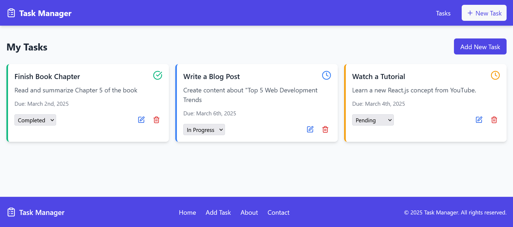

# MERN Task Manager

A full-stack web application built with the MERN stack (MongoDB, Express, React, Node.js) that allows users to create, read, update, and delete tasks efficiently.

## Overview

This application provides a complete task management experience with a modern UI built with Tailwind CSS, including task creation, status tracking, due date management, and responsive design.

[](https://your-live-demo-url.com)
[](https://your-api-url.com)



## Features

- **Create Tasks**: Add new tasks with title, description, status, and due date
- **View Tasks**: See all your tasks in an organized, user-friendly interface
- **Update Tasks**: Edit task details or change their status as you progress
- **Delete Tasks**: Remove tasks you no longer need
- **Status Management**: Track tasks with three status options: pending, in progress, and completed
- **Responsive Design**: Works seamlessly on desktop and mobile devices
- **Modern UI**: Clean interface with Tailwind CSS styling
- **Toast Notifications**: Get feedback on actions with React Hot Toast

## Tech Stack

### Frontend
- React.js
- React Router for navigation
- Axios for API requests
- Tailwind CSS for styling
- React Hot Toast for notifications
- Date-fns for date formatting
- Lucide React for icons

### Backend
- Node.js
- Express.js for server framework
- MongoDB with Mongoose for database operations
- Dotenv for environment variables
- CORS for cross-origin resource sharing
- Morgan for HTTP request logging
- Helmet for security

## Project Structure

```
mern-task-manager/
├── frontend/                   # React frontend
│   ├── node_modules/           # Frontend dependencies
│   ├── public/                 # Static assets
│   ├── src/
│   │   ├── components/
│   │   │   ├── EditTask.jsx    # Task editing component
│   │   │   ├── Footer.jsx      # Footer component
│   │   │   ├── Navbar.jsx      # Navigation bar component
│   │   │   ├── TaskForm.jsx    # New task creation form
│   │   │   └── TaskList.jsx    # List of tasks component
│   │   ├── api.js              # API service for backend communication
│   │   ├── App.jsx             # Main React component
│   │   ├── index.css           # Global styles with Tailwind
│   │   └── main.jsx            # React entry point
│   ├── .gitignore              # Git ignore file
│   ├── index.html              # HTML template
│   ├── package.json            # Frontend dependencies and scripts
│   ├── postcss.config.js       # PostCSS configuration
│   ├── tailwind.config.js      # Tailwind CSS configuration
│   └── vite.config.js          # Vite bundler configuration
│
├── backend/                    # Express backend
│   ├── node_modules/           # Backend dependencies
│   ├── controllers/
│   │   └── taskController.js   # Task CRUD operations logic
│   ├── models/
│   │   └── taskModel.js        # Mongoose model for tasks
│   ├── routes/
│   │   └── taskRoutes.js       # API endpoints for tasks
│   ├── .env                    # Environment variables
│   ├── .gitignore              # Git ignore file
│   ├── package.json            # Backend dependencies and scripts
│   └── server.js               # Express server entry point
│
└── README.md                   # Project documentation
```

## Prerequisites

- Node.js (v14 or higher)
- npm or yarn
- MongoDB (local installation or MongoDB Atlas account)

## Installation

### Setting Up the Backend

1. Clone the repository
   ```bash
   git clone https://github.com/yourusername/mern-task-manager.git
   cd mern-task-manager
   ```

2. Install backend dependencies
   ```bash
   cd backend
   npm install express mongoose dotenv cors morgan helmet
   npm install nodemon --save-dev
   ```

3. Create a `.env` file in the backend directory with the following variables:
   ```
   PORT=5000
   MONGODB_URI=mongodb://localhost:27017/task-manager
   NODE_ENV=development
   ```

4. Start the backend server
   ```bash
   npm run dev
   ```
   The server will run on http://localhost:5000

### Setting Up the Frontend

1. Open a new terminal and navigate to the frontend directory
   ```bash
   cd ../frontend
   ```

2. Install frontend dependencies
   ```bash
   npm install axios react-router-dom react-hot-toast date-fns lucide-react
   npm install -D tailwindcss@3.3.3 postcss@8.4.31 autoprefixer@10.4.15
   npx tailwindcss init -p
   ```

3. Create a `.env` file in the frontend directory (if needed):
   ```
   VITE_API_URL=http://localhost:5000/api
   ```

4. Start the frontend development server
   ```bash
   npm run dev
   ```
   The application will open in your browser at http://localhost:5173

## Database Schema

### Task Schema
```javascript
const taskSchema = new mongoose.Schema({
  title: { type: String, required: true },
  description: { type: String },
  status: { 
    type: String, 
    default: 'pending', 
    enum: ['pending', 'in progress', 'completed'] 
  },
  dueDate: { type: Date }
});
```

## API Endpoints

### Tasks

| Method | Endpoint        | Description         | 
|--------|-----------------|---------------------|
| GET    | /api/tasks      | Get all tasks       |
| POST   | /api/tasks      | Create a new task   |
| GET    | /api/tasks/:id  | Get task by ID      |
| PUT    | /api/tasks/:id  | Update task by ID   |
| DELETE | /api/tasks/:id  | Delete task by ID   |

## Usage Guide

1. **Adding a New Task**:
   - Click the "New Task" or "Add New Task" button
   - Fill in the task details (title, description, status, due date)
   - Click "Save" or "Add Task"

2. **Viewing Tasks**:
   - All tasks are displayed on the main dashboard
   - Each task shows its title, description, status, and due date

3. **Updating a Task**:
   - Click the edit (pencil) icon on a task
   - Modify the task details in the form
   - Click "Update" to save changes

4. **Changing Task Status**:
   - Select a different status from the dropdown menu
   - The task status will update immediately

5. **Deleting a Task**:
   - Click the delete (trash) icon on a task
   - Confirm deletion when prompted

## Deployment

### Backend Deployment (Render)
1. Create a new Web Service in Render
2. Connect your GitHub repository
3. Set the build command: `npm install`
4. Set the start command: `node server.js`
5. Add environment variables from your `.env` file
6. Deploy the service

### Frontend Deployment (Vercel)
1. Push your code to GitHub
2. Import the project in Vercel
3. Set the root directory to `frontend`
4. Configure environment variables
5. Deploy the application

## Future Enhancements
- User authentication and personal task lists
- Task categories and tags
- Task priority levels
- Due date reminders and notifications
- Dark/light theme toggle
- Task sorting and filtering options
- Drag and drop interface for status changes

## License

This project is licensed under the MIT License - see the LICENSE file for details.

## Acknowledgments
- MERN stack documentation and tutorials
- Tailwind CSS for the responsive design system
- React Hot Toast for the notification system
- PLP MERN module of specialization 
- PLP (Power Learn Project) School for the knowledge and support
- All open-source packages used in this project
